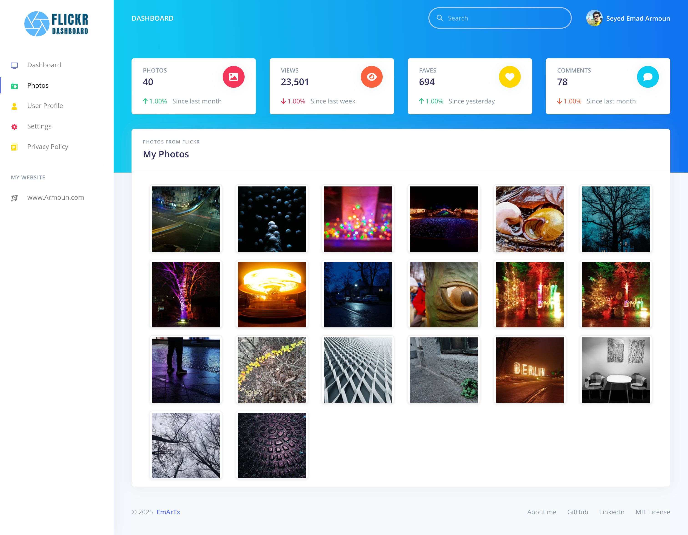
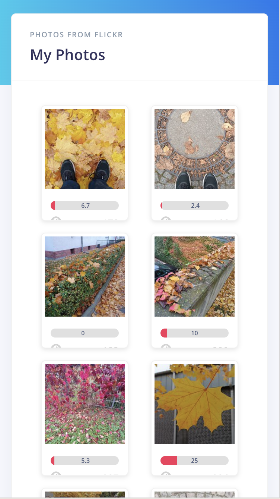
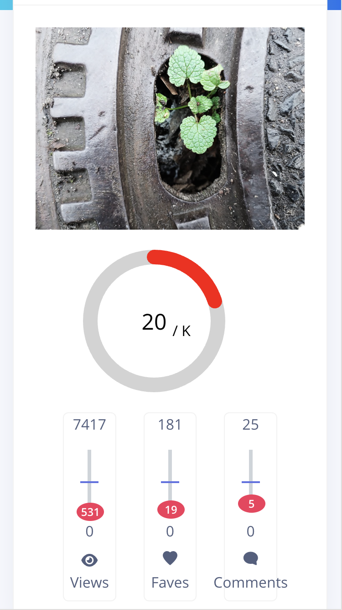

# 📸 Flickr Dashboard

**Flickr Dashboard** is a responsive web application designed to give users an enhanced view and analysis of their Flickr photos. It integrates with the Flickr API and leverages modern tools to deliver a fast, efficient, and user-friendly experience.



---

## 🧱 Monorepo Architecture

This project is organized as a **monorepo** with multiple packages:

- `core`: Shared TypeScript types and models used by both frontend and backend  
- `frontend`: React-based web UI  
- `functions`: Firebase Functions to handle server-side logic

This setup allows **shared logic and types**, reducing duplication and improving type safety across the stack.

---

## 🧩 Tech Stack

| Area              | Technology                         |
|-------------------|-------------------------------------|
| Frontend          | React + TypeScript + Reactstrap     |
| Naming Convention | Atomic Design pattern               |
| Backend           | Firebase Functions (Node.js)        |
| Database          | Firestore (NoSQL, nested data)      |
| DevOps            | Docker + Firebase CLI               |
| Scheduling        | Firebase Scheduled Functions (Cron) |
| Cache System      | React Query (useQuery, useMutation) |
| Performance       | Promise Pool + API response caching |
| Reliability       | Retry logic on external API calls   |

---

## 📱 Features

- Responsive design for desktop and mobile  
- Google Authentication via Firebase  
- Flickr API Integration to fetch photos and metadata  
- Interest Rate algorithm to rank photos by actual attention  
- Realtime caching using useQuery()  
- Retry logic for API failures  
- Scheduled background jobs  
- Shared type system using a central core package

---

## 🔢 Interest Rate Formula

Photos are ranked using a custom algorithm designed to reflect real user interest:

```
Interest Rate = (views ^ 0.5) + (favorites * 2) + (comments * 3)
```

This gives a fair ranking by factoring in views, favorites, and comments with weighted values.

---

## 🔄 Async Execution & API Resilience

- Uses Promise Pool to manage concurrent API calls  
- Retry mechanism automatically re-attempts failed API requests  
- Caching using React Query improves performance and responsiveness

---

## ⏱️ Cron Jobs (Scheduled Tasks)

Scheduled tasks are implemented using Firebase Scheduled Functions, which:

- Periodically fetch the latest photo data  
- Recalculate interest rates for all photos  
- Keep the dashboard metrics fresh and up-to-date

---

## 🗃️ Nested Data with Firestore (NoSQL)

Firestore is used for storing nested and hierarchical data:

```
users/{userId}/photos/{photoId}
```

This allows efficient queries scoped per user and photo.

---

## 🎨 Theme & Design System

- Built using Reactstrap  
- Styling is clean and minimal, based on Bootstrap principles  
- Component structure follows Atomic Design:

```
components/  
├── atoms/  
├── molecules/  
├── organisms/  
├── templates/  
└── pages/
```

---

## 🚀 Getting Started

### Prerequisites

- Node.js (v16 or newer)  
- Yarn  
- Firebase CLI

### Installation

```
git clone https://github.com/your-username/flickr-dashboard.git  
cd flickr-dashboard  
yarn install
```

### Running the App

```
yarn start:fe
```

In case you need to run the backend on your local you can use this command:
```
yarn start:be
```

---


## Deployment on Firebase

To deploy the project on Firebase, follow these steps:

1. **Install Firebase CLI**:
   ```bash
   npm install -g firebase-tools
   ```

2. **Login to Firebase**:
   ```bash
   firebase login
   ```

3. **Build and Deploy Firebase Functions**:

   Simply run this command, It navigates to the functions directory and builds the project before deploying it:
   ```bash
   yarn deploy:be
   ```

4. **Build and Deploy the Frontend**:

   Simply run this command, It navigates to the frontend directory and builds the project before deploying it:
   ```bash
   yarn deploy:fe
   ```

---

## 🐳 Docker Support

The project comes with Dockerfile and docker-compose.yml:

```
docker-compose up --build
```

This will spin up both frontend and backend services in isolated containers.

---

## 📝 License

This project is licensed under the [MIT License](./LICENSE).

---

## 🙌 Contributing

Feel free to fork the repo, open issues, or submit pull requests!

---

## 📬 Contact

For questions, suggestions, or collaboration, feel free to reach out.

Email: [Emad.Armoun@gmail.com](emad.armoun@gmail.com)

Website: [EmArTx.net](https://www.emartx.net)

---

## 📷 Screenshots

### Desktop


### Mobile




